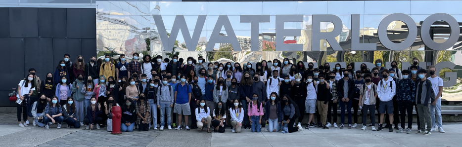

# Systems Design Engineering Class of 2026 Profile

[About](https://github.com/SYDE-26/1A-Class-Profile-Website/edit/main/README.md#about) | [Tech Stack](https://github.com/SYDE-26/1A-Class-Profile-Website/edit/main/README.md#tech-stack) | [Developers](https://github.com/SYDE-26/1A-Class-Profile-Website/edit/main/README.md#developer-github-hargun-sibal-jonathan-kim-shushawn-saha-aashi-shah-jason-wang-lisa-zhao--ryan-maxin) | [Website Visual](https://github.com/SYDE-26/1A-Class-Profile-Website/edit/main/README.md#website-visual) | [Class Photo](https://github.com/SYDE-26/1A-Class-Profile-Website/edit/main/README.md#class-image)

#### VISIT WEBSITE HERE: [https://syde26.life](https://syde26.life/)

  

### About 
Every year, the Systems Design Engineering program at the University of Waterloo opens their applications for a new batch of fresh, young engineers intrigued by what SYDE truly is. Websites tell them, it's about applying a systemic thinking process to a breadth of engineering disciplines. Big words, but what does that truly mean?

As much as we'd love to answer that question, we definitely cannot. However, there are things about our SYDE experience so far that we CAN pick out for you - from academics and job statistics, to other, *fun* aspects of university life. To truly embody the idea that we create the experience that we want, we've put together the data we've gotten from the SYDE 2026 cohort to provide some insight as to who we are, where we come from, and what we're doing right now!

We've got a dedicated team of 20 students from our cohort working on this project, and we'll be continuously working on it throughout our future study and co-op terms. Want to check in on the 26's? Feel free to revisit this profile whenever for the most updated information about the SYDE 2026 cohort!

#### Developer Github: [Hargun Sibal](https://github.com/hargun-27), [Jonathan Kim](https://github.com/jonathankim345), [Shushawn Saha](https://github.com/ShushawnS), [Aashi Shah](https://github.com/aashi-s), [Jason Wang](https://github.com/jwxng), [Lisa Zhao](https://github.com/lisazhao30) & [Ryan Maxin](https://github.com/Ryanmaxin)

### Tech Stack
**Languages**: JavaScript, HTML, CSS  
**Framework**: React, Chart.Js  
**Technologies/Tools**: Firebase, Vercel, Material-UI, jQuery  

## Website Visual

#### Home 

  

#### Navigation 

  

#### Demograhics 

  

#### Photo Gallery

  

#### About

  

## Class Image

  

<!--

-->

